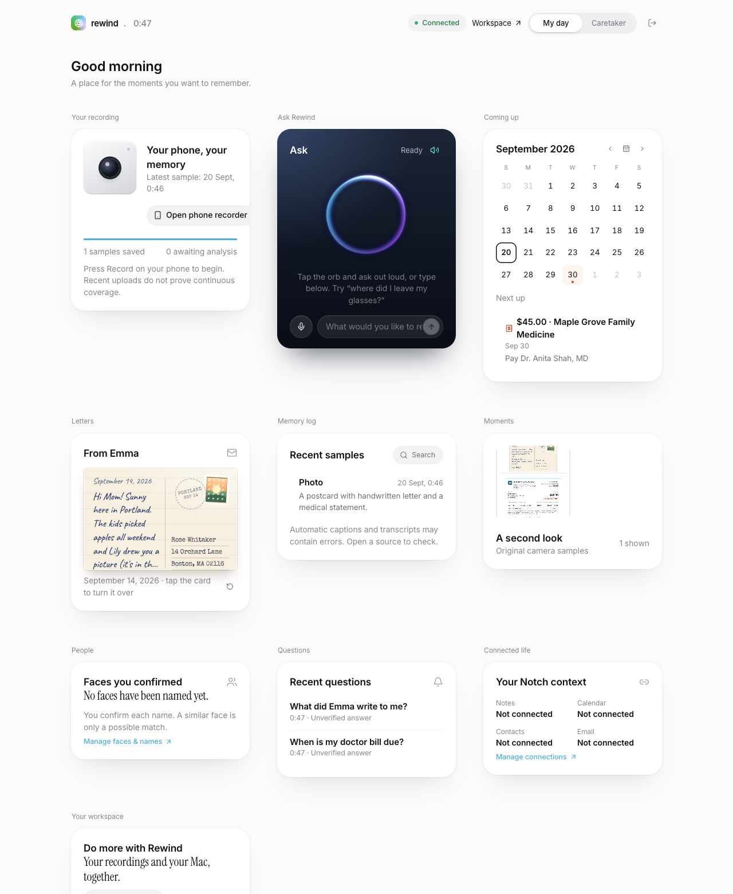
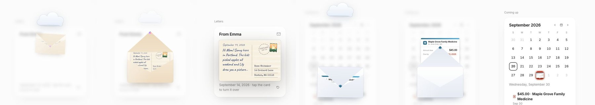
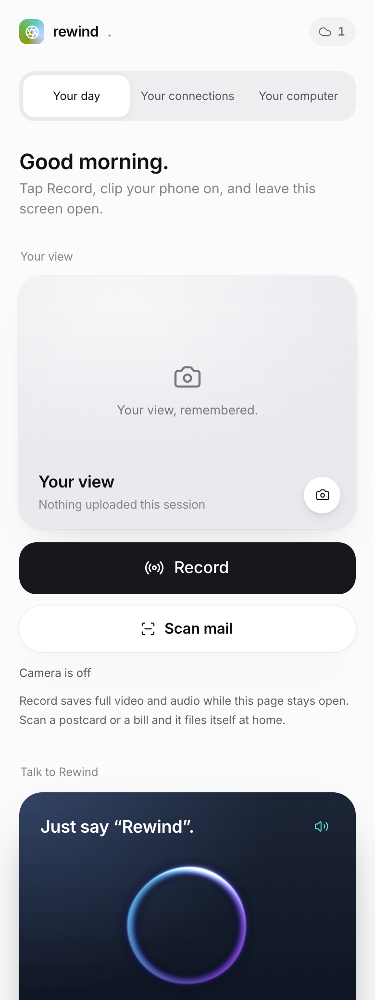
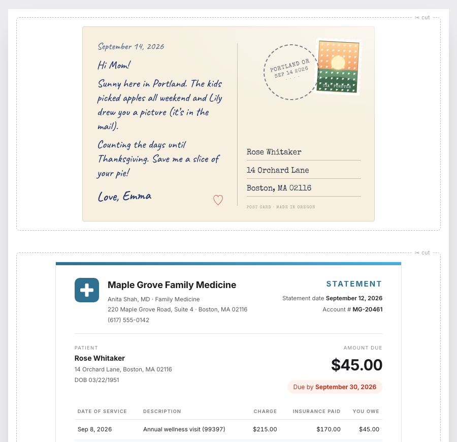

# Rewind

A memory helper for Grandma. Her phone clips to her shirt and records her day.
She talks to it ("Rewind, where did I leave my glasses?") and it answers out
loud, from what it actually saw. When she holds a postcard or a bill up to the
camera, the postcard lands in her Notes and the bill lands on her calendar,
on the big screen at home.

**Phone-first personal memory, with a built-in Mac memory and control agent.** Scan a QR code, tap Record,
and clip the phone to your chest. Ask about recorded moments and connected
notes, emails, appointments, friends, and family in one workspace. Read the
[user-confirmed product brief](docs/PRODUCT-VISION.md) and the
[phone and Notch setup](docs/PHONE-NOTCH.md). The existing ESP32 camera is an
additional capture input. The complete pinned Notch source is bundled in
`integrations/notch` as Rewind's native Mac component; no separate Notch clone
or installation is required. Its original provenance is retained.

Vision and memory inference run on the ASUS with its 35B model. Deepgram handles
hearing and speaking; signed-in Codex reviews personal-memory evidence before speech.
Ordinary conversation does not require a photo or an evidence review.

<p align="center">
  
</p>

## What it does

**Records the day from a phone.** One tap on Record. The phone keeps the
screen awake, saves full video and audio, and sends one small photo per second
to the server for analysis. Uploads queue on the phone when the network drops.

**Talks with you and answers memory questions.** Tap the orb for a microphone-only
conversation. Record separately enables video capture and hands-free questions.
Deepgram Nova-3 transcribes utterances; general conversation answers directly,
while personal-memory questions retrieve evidence for review before being read aloud. The restored dashboard recall card has a microphone
button, Test voice, and explicit Retry voice controls. Computer requests and
contextual follow-ups retain the existing Notch conversation routing.

**Recognizes mail before filing it.** Camera saves a still photo in Moments.
ASUS checks for a personal letter/postcard or medical bill; only detected mail
uses the matching fixed demo details (`source=model+template`). The postcard
flies into Notes and the bill into Calendar. Ordinary scans stay in Moments.

**Notices when she eats (experimental).** Food held up to the mouth in one
photo and gone from the next two is recorded as a meal: what it was, when, and
the bite photo. "Did I eat lunch?" answers from that record. See
[docs/MEALS.md](docs/MEALS.md).

**Two views of one home.** "My day" is for Grandma: big cards, a flippable
postcard, a calendar you can tap through. "Caretaker" is for family: alerts,
what she scanned, what she asked, device health.

<p align="center">
  
</p>

<p align="center">
  
  &nbsp;&nbsp;
  
</p>

## Run it

Server (Python 3.11+, Ollama with a vision model):

```bash
python3 -m venv .venv && source .venv/bin/activate
pip install -e '.[audio,dev]'
python scripts/setup.py            # writes .env with fresh keys
ollama pull qwen3.5:35b-a3b-q4_K_M # or a smaller vision model for a laptop
ollama pull nomic-embed-text
```

Add to `.env`:

```bash
REWIND_DEEPGRAM_API_KEY=...        # spoken questions and answers
REWIND_VISION_MODEL=qwen3.5:35b-a3b-q4_K_M
REWIND_REASONING_MODEL=qwen3.5:35b-a3b-q4_K_M
```

Build the web app and start:

```bash
cd web && pnpm install --frozen-lockfile --ignore-scripts && pnpm build && cd ..
python -m uvicorn rewind.app:create_app --factory --host 0.0.0.0 --port 8000
python scripts/open_workspace.py   # opens a one-time sign-in link and prints a pairing code
```

| Page | What it is |
|---|---|
| `/` | Home dashboard. `#care` opens the caretaker view. |
| `/phone` | The recorder. Open it on the phone over HTTPS (camera and microphone need a secure origin). |
| `/print` | The demo mail. `/print/postcard` and `/print/bill` print one piece each; ready PDFs: [postcard](docs/print/postcard.pdf), [medical bill](docs/print/medical-bill.pdf). Print at 100%. |
| `/workspace` | Full controls: Notch context, people, Mac commands, usage. |

Without a Deepgram key the server transcribes with faster-whisper and the
browser's built-in voice reads the answers. Everything else is the same.

## Demo script

For the protected walkthrough branch, use [the demo guide](docs/DEMO.md). Its
private reviewed answers and prepared voice survive resetting the live demo.

1. Open `/` on the big screen and `/phone` on the phone. Tap Record.
2. Hold the printed postcard and bill in front of the camera. Tap Camera.
   Watch the home screen: postcard first, then the bill onto September 30.
3. Say: "Rewind, when is my doctor's bill due?" The phone checks the evidence and reads back the due date.
4. Say: "Rewind, what did Emma write to me?"
5. Tap the postcard on the home screen to turn it over. Tap the 30th on the
   calendar to open the bill.

`REWIND_SCAN_DEMO_TEMPLATE=true` uses the matching `/print` details only after
recognition. A letter-only scan never adds a bill, and a bill-only scan never
adds a letter. Set it to false to read document details from the image.

## How it fits together

```
phone orb → microphone question → Deepgram → conversation / memory / Notch routing
phone Record → retained video + durable hands-free audio → same routing
conversation → natural response → shared speech player → phone
memory → ASUS inference → Codex evidence review → shared speech player → phone
phone Camera → saved JPEG in Moments → recognize mail → Notes / Calendar
```

The phone's explicit questions are owned by `web/lib/use-phone-question.ts`;
`phone-capture.ts` owns capture and uploads; `phone-storage.ts` preserves the
original bytes and recording sessions for offline retry. `server-speech.ts` owns
browser playback for both phone and desktop. Server `conversation.py` routes
requests; `chat.py` handles ordinary conversation; `memory.py` retrieves personal
sources. Keep these boundaries shared instead of adding a second voice client.

Recall stays evidence-only: the model answers from retrieved frames,
transcripts, connected Notch documents, and scanned mail, and must cite them.
The prompt asks for one or two friendly sentences in everyday words.

## Tests

```bash
.venv/bin/python -m pytest -q          # Isolated server tests; no model downloads
cd web && pnpm exec tsc --noEmit -p . && pnpm exec oxlint app components lib
```

For repeated phone conversation, camera/recording, permission recovery and mobile
layouts in Chromium and WebKit, follow [Phone testing](docs/PHONE-TESTING.md).
It distinguishes controlled fixtures, actual speech/model integration and physical-device checks.

Run `scripts/run_voice_mail_live.py --env-file data/phone-demo.env --asus --node /path/to/node`
for real Deepgram, ASUS inference, evidence review and browser playback against
isolated demo data. See [validation details](docs/evaluations/UI-VOICE-RESTORE-2026-09-20.md).

`server/tests/test_voice_scans.py` covers the wake word, spoken-answer
trimming, the scan template merge, the scan upload path, recall over scanned
mail, and the voice routes with a fake Deepgram.

## More

- [Voice and mail: design notes and limits](docs/VOICE-AND-MAIL.md)
- [Full setup guide: ASUS backend, ESP32 camera, wearable microphone](docs/SETUP-GUIDE.md)
- [Product brief](docs/PRODUCT-VISION.md) · [Architecture](docs/ARCHITECTURE.md) · [API](docs/API.md)
- [Phone and Notch setup](docs/PHONE-NOTCH.md) · [Hands-free details](docs/HANDS-FREE.md)
- [Evaluations](docs/evaluations) · [Research notes](research/README.md)

This is a working prototype, not a promise of perfect recall. Frames are one
per second; things out of view, missed captures, unclear speech, and model
mistakes are real. Originals are kept, failures are shown, and answers without
evidence say so.

### Direct phone access for the hackathon

The shared demo can opt into `REWIND_BROWSER_OPEN_ACCESS=true` in its private
server environment. Then the phone QR points to `/phone/`, opens without sign-in,
and remains reusable. Anyone who can reach the server has workspace access in
this mode. The default remains authenticated for private installations.
