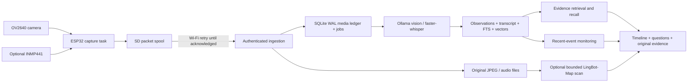

# Architecture and efficiency

## Local boundaries

The ESP32 captures and transports; the ASUS host performs inference, storage and search. Neither all-day video nor an LLM belongs in the microcontroller's RAM. The web dashboard is a static React export served by the same Python process as the API; the system does not require public hosting. The development dashboard uses a local reverse proxy. No recordings are sent to an external model in the default `ollama` configuration.

SQLite is the source of truth for a single wearer. WAL and `synchronous=FULL` protect committed metadata. Original files are flushed, renamed atomically, and their directory flushed before a job is committed and an upload acknowledged. If a process is killed between file rename and DB commit, an unindexed orphan file can remain; it is not falsely acknowledged and the device retries. Run periodic disk accounting/backup for long deployments. Database rows currently hold absolute media paths; preserve the installation path when restoring, or update those paths during migration.

Capture validation rejects invalid media, oversized requests, future/nonfinite timestamps, mismatched devices, and conflicting sequence retries. The device credential can only upload and heartbeat. Workspace reading/deletion requires the separate admin credential or an expiring signed HttpOnly session. Cookie writes check same-origin, media endpoints are authenticated, and no secret is exposed to client JavaScript. There is no multi-tenant identity layer: deploy one workspace per wearer.

A completed upload returns only after storage/metadata commit. A model call happens later. Jobs are claimed transactionally with a lease, retried with exponential backoff, and visibly failed after five attempts. A failed model never deletes the original. Lease recovery permits restart; the supplied single worker is the recommended configuration. Do not run multiple API processes. A very slow job exceeding its 15-minute lease can be retried by another worker; keep worker count one until measuring inference, or extend the lease for unusually long tasks.

## Every frame versus real-time

“Every frame” means each JPEG actually captured and received by this system gets its own vision-language analysis. Default capture interval: 1000 ms. An OV2640 may internally expose more frames than the configured capture loop reads. This is **not** exhaustive analysis of a 30 fps video stream. The video importer is an explicit offline path for every decoded frame of a supplied video.

No perceptual-hash deduplication skips semantic analysis. Originals are retained even if observations look identical. This favors evidence completeness over throughput. RAM use stays bounded by a small worker count, per-request size limit and bounded retrieval; raw originals live on SSD/SD, not in 128 GB memory. One shared model can handle vision and questions without loading two copies. Keep an eye on prompt/KV-cache size as well as weight size.

Storage planning examples, not measured camera output:

| Stream | Assumption | 20 hours |
|---|---|---:|
| JPEG | 50 KB × 1 frame/s | 3.6 GB |
| PCM microphone | 16,000 samples/s × 2 bytes | 2.304 GB |
| Text embeddings | 768 float32 dimensions × 72,000 frames | ~221 MB before indexes/metadata |

Actual JPEG size varies with resolution/quality/scene. The default 100 GB server budget protects against unbounded ingestion, and a 2 GB free-space reserve rejects uploads before disk exhaustion. It does not reserve 100 GB in advance. SSD capacity is independent of system RAM. The development laptop currently has no GPU runtime configured; ASUS throughput must be measured on that host.

Server storage has no automatic retention deletion. Users can delete recordings and their derived answers from the dashboard; SD deletes only acknowledged packets. A full disk causes HTTP 507, then device-side buffering. A full SD card stops new captures visibly. Metadata export does not include raw media; back up the entire data directory for a full archive (stop the process or use SQLite's backup API and a consistent media snapshot).

## Recall and certainty

Each observation links to its original frame/audio. Audio words and segment times are retained when provided by the transcriber. No diarization or biometric speaker identification is claimed. Names heard in speech remain transcript content, not verified identity. An exact quote must be checked against the original waveform.

FTS5 provides lexical search. Optional local embeddings are persisted as float32 arrays; retrieval scans time-filtered vectors in bounded batches and fuses semantic and lexical ranks. This is adequate for a hackathon-scale personal index, not a billion-vector service. If embeddings are unavailable, lexical search still works and missing embeddings are counted. Existing failed embeddings are not automatically backfilled; reprocessing/backfill is a follow-up optimization.

A query planner can retrieve a reference event for “before/after” questions; ambiguous repeated anchors remain a limitation. An answer receives a bounded evidence set, re-examines up to three matching original frames, and must cite IDs that actually exist in that set. IDs are validated, but semantic truth still depends on the model and recordings. If generation fails or fabricates IDs, the application returns evidence-only results. If retrieval finds nothing, it explicitly reports missing evidence.

Object descriptions refer to last observed relative position. There is no persistent object identity across look-alikes, calibrated 3D tracking, or unseen-room extrapolation. Confidence fields are model estimates, not calibrated probabilities.

## Alerts and speech

Rules evaluate recent observations and suppress repeated alerts during their cooldown. Historical backlog older than five minutes cannot issue a misleading live alert. Rules run only on recordings captured after the rule was created. Missing observations do not establish that an object is absent. Alerts appear on the dashboard; this version does not send unsolicited messages or system notifications.

Voice questions from the browser use explicit recording controls. A wearable microphone can route a segment beginning with “Hey Rewind” to recall after transcription. This has chunk-boundary and latency limitations, and is not an always-responsive wake-word model. The browser can read answers aloud when the user presses the speaker button. A separately wired necklace speaker is not implemented.

## Optional integrations

- OpenAI: image reasoning through Responses and audio transcription through the API, selected explicitly by configuration. The user must supply a key.
- Elasticsearch: a durable outbox mirrors event documents and retries failures independently of recording. Search is currently local; do not claim Elasticsearch powers recall in a sponsor submission until implementing and validating that retrieval path.
- LingBot-Map: an isolated CUDA environment reconstructs a bounded scan into a real point cloud. It does not participate in reliable capture or core recall.
- StreamMind / Em-Garde: architectural inspiration only. Their research implementations, benchmark claims, and sponsor-specific efficiency scores are not claimed here.

ElevenLabs, Devin, and sponsor competition submissions are not integrated. Browser audio playback and local transcription supply the implemented voice experience. They can be added after the core hardware demo passes.
